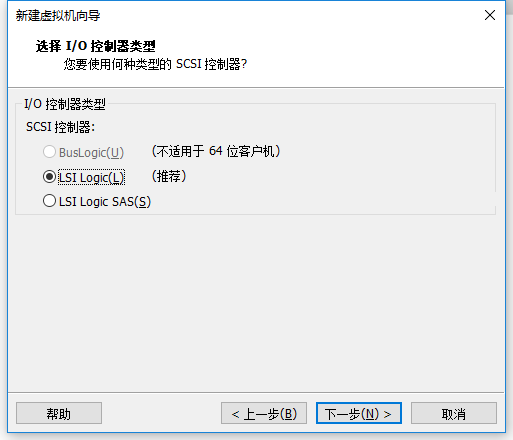

# 安装 CentOS 7
## 一、CentOS 7官方下载

CentOS 7官方下载地址：https://www.centos.org/download/

 在CentOS官方网站上，CentOS 7提供了三种ISO镜像文件的下载：DVD ISO、Everything ISO、Minimal ISO。
以下针对各个版本的ISO镜像文件，进行一一说明：

- CentOS-7.0-x86_64-DVD-1503-01.iso              标准安装版，一般下载这个就可以了（推荐）
- CentOS-7.0-x86_64-NetInstall-1503-01.iso       网络安装镜像（从网络安装或者救援系统）
- CentOS-7.0-x86_64-Everything-1503-01.iso     对完整版安装盘的软件进行补充，集成所有软件。（包含centos7的一套完整的软件包，可以用来安装系统或者填充本地镜像）
- CentOS-7.0-x86_64-GnomeLive-1503-01.iso   GNOME桌面版
- CentOS-7.0-x86_64-KdeLive-1503-01.iso         KDE桌面版
- CentOS-7.0-x86_64-livecd-1503-01.iso            光盘上运行的系统，类拟于winpe 
- CentOS-7.0-x86_64-minimal-1503-01.iso         精简版，自带的软件最少

## 二、虚拟机准备

### 1.打开VMwear选择新建虚拟机


### 2.典型安装与自定义安装

典型安装：VMwear会将主流的配置应用在虚拟机的操作系统上，对于新手来很友好。

自定义安装：自定义安装可以针对性的把一些资源加强，把不需要的资源移除。避免资源的浪费。

这里我选择自定义安装。


### 3.虚拟机兼容性选择

这里要注意兼容性，因为不同版本的VMware对虚拟硬件支持情况不同。举个例子，老版本的只支持4G内存，新版本支持8G内存等等（本例子只是为了说明虚拟硬件的含义，不代表实际情况。）。因此如果需要改虚拟机运行在旧版本的VMware中，这里需要选择旧版本的VMware的版本号。这里我并不需要以后让该虚拟机运行在其他版本的VMware中，因此选择的就是默认的版本号，即正在使用的VMware版本号。在右下方的限制中，可以看到支持的虚拟硬件状况。选择好后，点击下一步。


### 4.选择稍后安装操作系统

接下来根据实际情况选择要安装的操作系统。本文这里选择Linux系统，版本号为CentOS 7 64位，之后点击下一步。


### 5.操作系统的选择

这里选择之后安装的操作系统，正确的选择会让vm tools更好的兼容。这里选择linux下的CentOS


### 6.虚拟机位置与命名

虚拟机名称就是一个名字，在虚拟机多的时候方便自己找到。

VMwear的默认位置是在C盘下，我这里改成C:\Linux\CentOS7-64。


### 7.处理器与内存的分配

处理器分配要根据自己的实际需求来分配。在使用过程中CPU不够的话是可以再增加的。这次只做安装CentOS演示，所以处理器与核心都选1。


内存也是要根据实际的需求分配。我的宿主机内存是8G所以我给虚拟机分配2G内存。


### 8.网络连接类型的选择，网络连接类型一共有桥接、NAT、仅主机和不联网四种。

桥接：选择桥接模式的话虚拟机和宿主机在网络上就是平级的关系，相当于连接在同一交换机上。

NAT：NAT模式就是虚拟机要联网得先通过宿主机才能和外面进行通信。

仅主机：虚拟机与宿主机直接连起来

桥接与NAT模式访问互联网过程，如下图所示


桥接与NAT区别

这里选择桥接模式


### 9.其余两项按虚拟机默认选项即可




### 10.磁盘容量

磁盘容量暂时分配10G即可后期可以随时增加，不要勾选立即分配所有磁盘，否则虚拟机会将分配给CentOS，会导致宿主机所剩硬盘容量减少。

勾选将虚拟磁盘拆分成多个文件，这样可以使虚拟机方便用储存设备拷贝复制。


### 11.磁盘名称，默认即可


### 12.取消不需要的硬件

点击自定义硬件


选择声卡、打印机等不需要的硬件然后移除。


### 13.点击完成，已经创建好虚拟机。


## 3.安装CentOS

### 1.连接光盘

右击刚创建的虚拟机，选择设置


### 2.开启虚拟机

### 3.安装操作系统

开启虚拟机后会出现以下界面

1. Install CentOS 7 安装CentOS 7
2. Test this media & install CentOS 7 测试安装文件并安装CentOS 7
3. Troubleshooting 修复故障

选择第一项，安装直接CentOS 7，回车，进入下面的界面


选择安装过程中使用的语言，这里选择英文、键盘选择美式键盘。点击Continue


首先设置时间


时区选择上海，查看时间是否正确。然后点击Done


选择需要安装的软件


选择 Server with Gui，然后点击Done


选择安装位置，在这里可以进行磁盘划分。


选择自动配置分区，然后点击done


最后选择Begin Installation(开始安装)


设置root密码

设置root密码后点击Done

点击USER CREATION 创建管理员用户


输入用户名密码后点击Done


等待系统安装完毕重启系统即可


查看ip


就可以用xshell连接了

## 三.桥接模式网络配置

**1、配置ip地址等信息在/etc/sysconfig/network-scripts/ifcfg-ens33文件里做如下配置：**

 命令：

```
vi   /etc/sysconfig/network-scripts/ifcfg-ens33
```

默认如下：

```
YPE=Ethernet
PROXY_METHOD=none
BROWSER_ONLY=no
BOOTPROTO=dhcp
DEFROUTE=yes
IPV4_FAILURE_FATAL=no
IPV6INIT=yes
IPV6_AUTOCONF=yes
IPV6_DEFROUTE=yes
IPV6_FAILURE_FATAL=no
IPV6_ADDR_GEN_MODE=stable-privacy
NAME=ens33
UUID=192ffc19-4a0e-4439-92cd-6e63a0e53a1a
DEVICE=ens33
ONBOOT=no
```

**2、配置网络工作**

在/etc/sysconfig/network文件里增加如下配置

```
命令： vi /etc/sysconfig/network  
修改： NETWORKING=yes # 网络是否工作，此处一定不能为no
```

3、**配置公共DNS服务(可选)**

在/etc/resolv.conf文件里增加如下配置

```
nameserver 8.8.8.8
```

4、**关闭防火墙**

```
systemctl stop firewalld # 临时关闭防火墙
systemctl disable firewalld # 禁止开机启动
```

5、**重启网络服务**

```
service network restart
```

