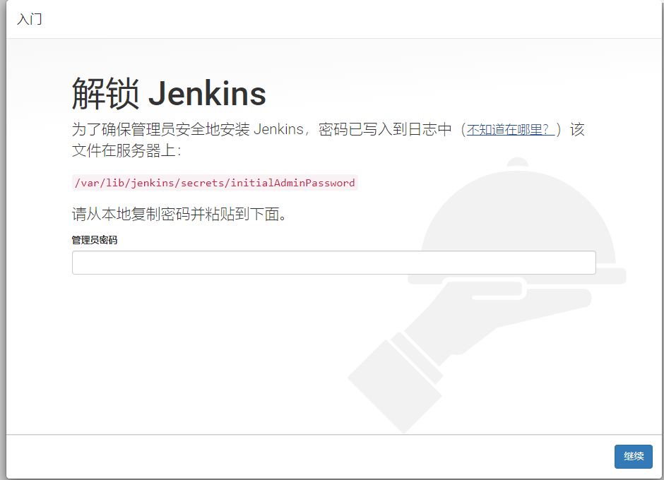

## 安装jenkins

### 1.下载安装

添加Jenkins库到yum库，Jenkins将从这里下载安装。

```
1 wget -O /etc/yum.repos.d/jenkins.repo http://pkg.jenkins-ci.org/redhat/jenkins.repo
2 rpm --import https://jenkins-ci.org/redhat/jenkins-ci.org.key
3 yum install -y jenkins
```

如果不能安装就到官网下载jenkis的rmp包，官网地址（http://pkg.jenkins-ci.org/redhat-stable/）（推荐）

```
1 wget http://pkg.jenkins-ci.org/redhat-stable/jenkins-2.176.2-1.1.noarch.rpm
2 rpm -ivh jenkins-2.176.2-1.1.noarch.rpm
```

配置jenkis的端口

```
 vi /etc/sysconfig/jenkins
```

找到修改端口号：

```
JENKINS_PORT="8080" 
```

修改Jenkins启动配置文件，指定java安装路径。

```
 vim /etc/init.d/jenkins
```


在candidates中第一行添加java路径，如下：

```
candidates="
/data/jdk/jdk1.8.0_221/bin/java
/etc/alternatives/java
/usr/lib/jvm/java-1.6.0/bin/java
/usr/lib/jvm/jre-1.6.0/bin/java
/usr/lib/jvm/java-1.7.0/bin/java
/usr/lib/jvm/jre-1.7.0/bin/java
/usr/lib/jvm/java-1.8.0/bin/java
/usr/lib/jvm/jre-1.8.0/bin/java
/usr/bin/java
```


修改防火墙允许8080端口访问

```
vim /etc/sysconfig/iptables
```


加入

```
-A INPUT -m state --state NEW -m tcp -p tcp --dport 8080 -j ACCEPT
```


重启防火墙生效

```
service iptables restart
```


### 2.停止/启动

```
service jenkins start/stop/restart
chkconfig jenkins on
```

- 安装成功后Jenkins将作为一个守护进程随系统启动
- 系统会创建一个“jenkins”用户来允许这个服务，如果改变服务所有者，同时需要修改/var/log/jenkins, /var/lib/jenkins, 和/var/cache/jenkins的所有者
- 启动的时候将从/etc/sysconfig/jenkins获取配置参数
- 默认情况下，Jenkins运行在8080端口，在浏览器中直接访问该端进行服务配置
- Jenkins的RPM仓库配置被加到/etc/yum.repos.d/jenkins.repo

### 3.打开jenkins

在浏览器中访问 
首次进入会要求输入初始密码如下图， 
初始密码在：/var/lib/jenkins/secrets/initialAdminPassword 



选择“Install suggested plugins”安装默认的插件，下面Jenkins就会自己去下载相关的插件进行安装。

创建超级管理员账号 